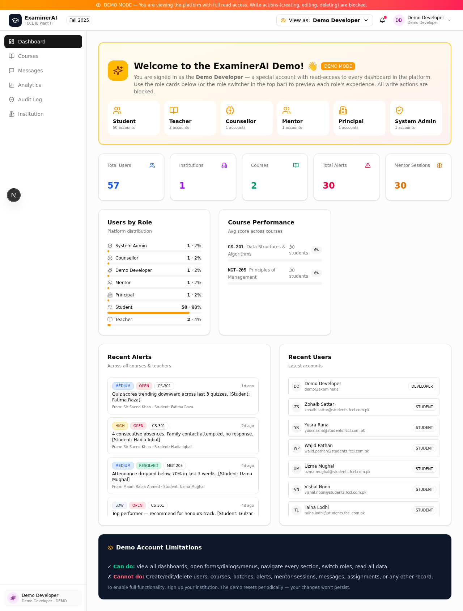

# ExaminerAI

**AI-Powered Assessment & Mentorship Platform** — built for FCCL JB Plant Institute of Technology.

A comprehensive platform that unifies academic evaluation, GROW-model coaching, psychological & educational mentorship, real-time alerts, and analytics — built for students, teachers, counsellors, mentors, principals, and admins.



---

## 🎯 Live Demo

Try the platform instantly — **no signup required**:

- **URL:** [your-vercel-url.vercel.app](https://examiner.ai)
- **Demo login:** `demo@examiner.ai` / `demo123`
- **Other accounts:** any seeded user (password: `demo123`)

The demo account gives you read-access to every dashboard. Use the role switcher in the top bar to preview Student, Teacher, Counsellor, Mentor, Principal, or Admin views. All write actions are blocked with a friendly toast.

---

## ✨ Features

### Role-Based Dashboards
Six specialised dashboards — each tuned to what that role needs:
- **Student** — GPA, course performance, attendance, alerts, mentor sessions, assignments
- **Teacher** — Gradebook, alerts sent (with counsellor responses), pending submissions, class sessions
- **Counsellor** — Urgent wellbeing queue, all alerts with responses, assigned student caseload
- **Mentor** — GROW coaching log (psychological & educational), mood tracking, follow-ups
- **Principal** — Institution-wide analytics, course performance, growth reports, audit log
- **Admin** — System-wide oversight, user management, audit trails, platform health

### GROW Coaching Model
Every mentor session follows the proven GROW framework:
- **G**oal — What does the student want to achieve?
- **R**eality — Where are they now?
- **O**ptions — What approaches are available?
- **W**ill — What will they commit to doing?

### Other Features
- 🧠 Psychological mentorship with mood tracking
- 🎯 Educational mentorship with study strategies
- 🔔 Real-time alerts (teacher → counsellor → resolved)
- ✨ AI course generation (outlines, timelines, practice problems)
- 💬 Role-aware messaging
- 📊 Institution analytics & growth reports
- 🛡️ Audit & compliance logging

---

## 🛠️ Tech Stack

- **Framework:** Next.js 16 (App Router, Turbopack)
- **Language:** TypeScript 5
- **Styling:** Tailwind CSS 4 + shadcn/ui (New York)
- **Charts:** Recharts
- **Database:** Prisma ORM (SQLite for local dev, PostgreSQL for production)
- **Auth:** Cookie-based session with role switching
- **State:** Zustand with persist middleware
- **Icons:** Lucide React

---

## 🚀 Local Development

### Prerequisites
- Node.js 20+ or Bun
- A database (SQLite is default for local dev)

### Setup

```bash
# 1. Install dependencies
bun install

# 2. Set up environment
cp .env.example .env
# Edit .env if you want to use a different DB

# 3. Push schema to database
bun run db:push

# 4. Seed demo data
bun run db:seed

# 5. Start dev server
bun run dev
```

Open [http://localhost:3000](http://localhost:3000) and click **"Try Demo"** to launch the demo.

### Useful Scripts

| Script | Description |
|--------|-------------|
| `bun run dev` | Start dev server on port 3000 |
| `bun run lint` | Run ESLint |
| `bun run db:push` | Push schema to DB |
| `bun run db:generate` | Regenerate Prisma client |
| `bun run db:seed` | Seed demo data (50 students, 2 courses, all dashboards) |
| `bun run db:reset` | Reset DB and re-run migrations |

---

## ☁️ Deploy to Vercel

### Option A: One-click via Vercel Dashboard

1. Push this repo to GitHub
2. Go to [vercel.com/new](https://vercel.com/new)
3. Import the GitHub repo
4. Add environment variable:
   - `DATABASE_URL` — your Postgres connection string
     (create one at [vercel.com/storage](https://vercel.com/storage) → New Postgres)
5. Click **Deploy** — Vercel will run `bun run vercel-build` which:
   - Detects Postgres from `DATABASE_URL`
   - Updates Prisma schema provider to `postgresql`
   - Generates Prisma client
   - Pushes schema to your Postgres
   - Seeds demo data
   - Builds Next.js

### Option B: Via Vercel CLI

```bash
# 1. Install Vercel CLI
npm install -g vercel

# 2. Login
vercel login

# 3. From the project root:
vercel link

# 4. Add environment variable (create a Postgres DB first at vercel.com/storage)
vercel env add DATABASE_URL
# Paste your postgres:// connection string when prompted

# 5. Deploy to preview
vercel

# 6. Deploy to production
vercel --prod
```

### Setting up the Postgres Database

1. Go to [vercel.com/storage](https://vercel.com/storage)
2. Click **New Postgres** → **Create*
3. Wait for it to provision (1-2 minutes)
4. Copy the `DATABASE_URL` connection string
5. Add it as an environment variable to your Vercel project (see steps above)

The `vercel-build` script will automatically:
- Switch Prisma from SQLite → PostgreSQL
- Create all tables
- Seed 50+ students, 2 courses, teachers, counsellors, mentors, alerts, mentor sessions, etc.
- Build the Next.js app

---

## 📊 Seeded Demo Data

The seed script creates:

| Entity | Count |
|--------|-------|
| Institution | 1 (FCCL JB Plant IT) |
| Users | 57 (1 admin, 1 principal, 2 teachers, 1 counsellor, 1 mentor, 50 students, 1 demo dev) |
| Courses | 2 (CS-301 Data Structures, MGT-205 Principles of Management) |
| Batches | 3 |
| Assessments | 18 |
| Class sessions | 36 |
| Assignments | 7 |
| Grades | ~500 |
| Alerts | 30 (with 22 responses) |
| Mentor sessions | 30 (mix of psychological & educational with GROW entries) |
| Messages | 16 |
| Timeline events | 50 |
| Growth reports | 2 |
| Audit logs | 10 |
| Interactions | 200 |

---

## 👤 Demo Accounts

All accounts have password `demo123`.

| Role | Email | Use case |
|------|-------|----------|
| Demo Developer | `demo@examiner.ai` | Full read access to all dashboards |
| Admin | `admin@examiner.ai` | System-wide oversight |
| Principal | `principal@fccl.com.pk` | Institution management |
| Teacher (CS) | `s.khan@fccl.com.pk` | CS-301 instructor |
| Teacher (MGT) | `r.ahmed@fccl.com.pk` | MGT-205 instructor |
| Counsellor | `counsellor@fccl.com.pk` | Student wellbeing |
| Mentor | `mentor@fccl.com.pk` | GROW coaching |
| Student (any) | `aisha.khan@students.fccl.com.pk` | Student view |

---

## 📁 Project Structure

```
src/
├── app/
│   ├── api/                    # API routes (auth, dashboard, courses, alerts, etc.)
│   ├── layout.tsx              # Root layout
│   ├── page.tsx                # Landing page / dashboard router
│   └── globals.css
├── components/
│   ├── dashboards/             # 7 role dashboards
│   │   ├── student-dashboard.tsx
│   │   ├── teacher-dashboard.tsx
│   │   ├── counsellor-dashboard.tsx
│   │   ├── mentor-dashboard.tsx
│   │   ├── principal-dashboard.tsx
│   │   ├── admin-dashboard.tsx
│   │   └── developer-dashboard.tsx
│   ├── shared/                 # Shared UI components
│   ├── ui/                     # shadcn/ui components
│   ├── app-shell.tsx           # Authenticated app shell (sidebar, topbar, role switcher)
│   └── landing-page.tsx        # Marketing landing page
├── lib/
│   ├── auth.ts                 # Session/cookie helpers
│   ├── auth-store.ts           # Zustand auth store + demoFetch wrapper
│   ├── db.ts                   # Prisma client
│   └── demo-guard.ts           # Demo write-block guard
prisma/
└── schema.prisma               # Full DB schema (User, Course, Batch, Alert, MentorSession, etc.)
scripts/
├── seed.ts                     # Demo data seeder
└── vercel-build.sh             # Vercel build orchestration
```

---

## 📝 License

© 2026 FCCL JB Plant Institute of Technology. All rights reserved.
